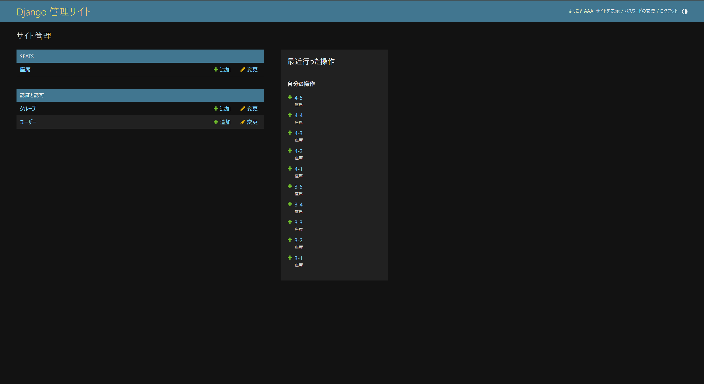
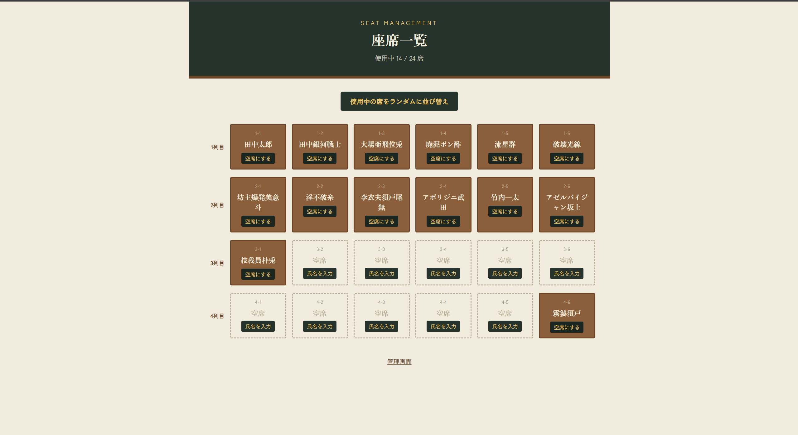

# 座席管理アプリ

Djangoの練習課題として作成した、教室の座席を管理するWebアプリです。
在庫管理システムの構成（一覧・登録・削除）を応用し、「商品」を「座席」に置き換えて作成しました。

## できること

- 座席一覧の表示（行・列ごとにグリッド表示、空席/使用中がひと目でわかる）
- 空席に氏名を入力して「使用中」にする（着席登録）
- 使用中の座席を「空席にする」（離席・削除に相当）
- 使用中の座席の氏名をランダムに並び替える（一定条件での自動並び替え機能）

## 技術構成

- Python 3.12 / Django 5.0
- DB: SQLite
- フロントエンド: Django Template + 素のCSS
- Docker Desktop（docker compose）で起動

## モデル構成

| フィールド | 内容 |
|---|---|
| row | 行番号 |
| col | 列番号 |
| occupant_name | 着席している生徒の氏名 |
| status | 空席 / 使用中 |

## 起動方法

```bash
docker compose up --build
```

別ターミナルで初回のみ以下を実行します。

```bash
docker compose exec web python manage.py makemigrations seats
docker compose exec web python manage.py migrate
docker compose exec web python manage.py createsuperuser
```

`http://localhost:8000/admin/` から座席（行×列）を登録したのち、
`http://localhost:8000/` で座席一覧が確認できます。

## スクリーンショット


